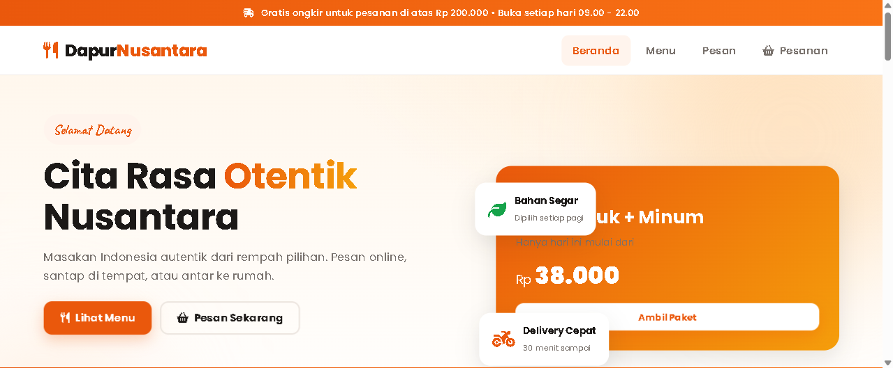

# Restaurant Website

<p align="center">
  Website restoran - menu makanan dan pemesanan online yang menggugah selera.
</p>

<p align="center">
  
  
  
  
</p>

<p align="center">
  
</p>

## Highlight

- **Front-end first** - repository berisi tampilan depan (public UI) yang siap jalan
- **Ringan & cepat** - tanpa framework berat, load cepat
- **Mudah di-deploy** - cukup PHP + database, tanpa setup rumit
- **Keamanan dasar terpasang** - prepared statements, sanitization, password hashing

## Fitur Utama

- Hero section menggugah selera
- Katalog menu
- Pemesanan online
- Galeri makanan
- Responsive design

## Teknologi

<details>
<summary><b>Lihat detail teknologi</b></summary>

**Backend**
- PHP 8.x - server-side scripting
- Order module (menu, pemesanan)
- API endpoint untuk data menu & order
- JSON-file based data storage

**Frontend**
- HTML5, CSS3, JavaScript (ES6+)
- Bootstrap 5 responsive
- Fetch API untuk data dinamis
- Animasi & hero section menarik

**Database**
- JSON file storage - portable

**Tooling & DevOps**
- Git & GitHub
- Laragon/WAMP
</details>

## Struktur Proyek

```
portofolio-food-web
  includes/    # Komponen yang di-include (header, footer, dll)
  assets/      # CSS, JS, gambar
  *.php        # Halaman tampilan depan
```

## Menjalankan

Prasyarat: [Laragon](https://laragon.org) / [XAMPP](https://www.apachefriends.org)

1. Clone repository:

   ```bash
   git clone https://github.com/Celieln/portofolio-food-web.git
   ```

2. Letakkan folder di `laragon/www/` atau `htdocs/`.
3. Buka `http://localhost/portofolio-food-web`.

## Kontribusi

Kontribusi sangat diterima! Baca [CONTRIBUTING](CONTRIBUTING.md) dahulu, lalu buat Pull Request atau buka [Issues](https://github.com/Celieln/portofolio-food-web/issues) untuk melaporkan bug / request fitur.

## Lisensi

Distributed under the [MIT](LICENSE) License. (c) [Celieln](https://github.com/Celieln)
